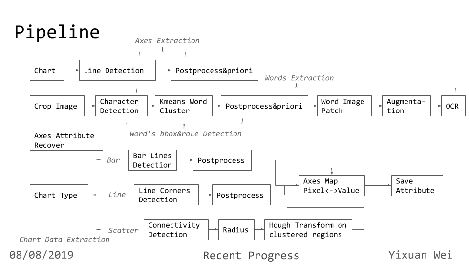

# Rev_Vis

## Pipeline

**整体流程如下：**

+ 当前只支持Bar Chart/Line Chart/Scatter Chart/Table Chart，以基本图像处理的方式来实现。  
+ 考虑到当前支持表格的特性，主要流程为：
  + 先进行坐标轴检测，基于Hough Line Detection（二值化+Sober Edge Filter+Hough），同时考虑两条坐标轴在左下角相交的先验。  
  + 根据坐标轴位置，crop x轴以下，y轴以左（即存在axis label+ticks value的位置）。在对应cropped image上先做连通域检测，得到每一个字符及其bounding box，然后用了Kmeans Cluster（这里后来考虑到可以直接做腐蚀膨胀让字符连成一起，然后通过连通域检测就可以...）得到每个单词的bounding box，把这个小的image做一些增强，输入到tessearct orc里去识别。（原因：直接整张图放进去做ocr的效果很差，*ref：Reverse-Engineering Visualizations: Recovering Visual Encodings from Chart Images EuroVis 2017*）  
  + 根据恢复出的坐标轴tick value去恢复出坐标轴的坐标位置与值的映射方程，这样可以得到任意位置的对应的坐标值。  
  + 之后根据不同的图像特性去恢复drawing object部分。  
    + 针对Bar Chart：crop x轴以上，y轴以右的图像，做line detection(或者直方图转换可以，但怕每个bar是同个颜色/复杂pattern)得到bar的边框。遍历x轴每一个label，将这个label往上映射，找到对应的bar，取其最顶部的边框线，映射到y轴得到value。  
    + 针对Line Chart：做corner point检测，然后恢复每条线的方程（即整条折线的方程），同Bar Chart，对每一个x轴label进行上映射，对应到某条线内，根据方程得到y坐标，然后得value。
    + 针对Scatter Chart：从每一个dot出发往x轴，y轴分别映射，得到值。考虑到图像clustered的特性，恢复dot坐标的方法如下：
      + 先做连通域检测，取连通域的radius众数作为dot的尺寸。  
      + 利用这个radius的估计，针对连通域检测中尺寸较大的区域（表示多个dot collected在一起），做Hough Transform检测，恢复出cluster area里的dots。
+ 注：  
  + 不支持含有legend图像。  
  + 原生实验数据集：见 *./data/cropped*。  
  + 这份代码完成得较为仓促，调试时间也不多，且基于一般图像处理的方法，必有较多疏漏，请见谅！  

## Schedule

+ 29/07/2019
> Finish axes extraction  
> Try to use OCR under engine of [Tesseract](https://github.com/tesseract-ocr/tesseract) but not good  
> According the axes to crop subchart and resize&rotate chart for OCR, still not excellent  

+ 30/07/2019  
> Finish character extraction  
> Merge characters belonging to a word to bbox together  
> Run OCR on word image patch, and its augmentated counterparts (rotation and resize)  

+ 31/07/2019
> Vote on OCR output to get one specific result from all augmented image patches
> Finish axes attribution recover and naive text roles recover
> Finish plot data fetching from bar chart and save to json

+ 01/08/2019
> Finish support on line data extraction and dot data extraction  
> Debug previous bugs in axes and OCR and others..  

+ 07/08/2019
> Add in support for table-like chart data  

## Problem

+ 01/08/2019
> Axes recovery: seem to mix the right-y axis in bar chart and when have a dot on the axis, it will crash down..  
> OCR: OMG!! The OCR is so poor that my effort to extract each word into image patch is in vain and one more question is that when you can't give a good cluster number prior, it will run ocr on a multiword patch, and output like "40\n\n30". Should avoid this situation  
> Need to generalize to pie chart (without the axes)  

## Work of Perception Remains

+ 05/08/2019
> If you want a better line/eclipse/circle detection, you can try this: [ELSDc](https://github.com/viorik/ELSDc)  
> You need create a better text role classifier.  
> Fix all the bugs in previous section, and think deeply into you previous structure: how to organize it modularly and structurally.  
